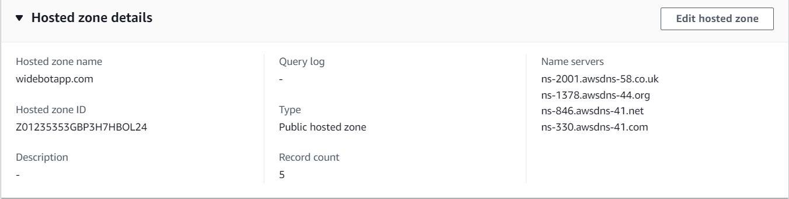

# WideBot DevOps Task 

## Description

**This task involves setting up an infrastructure on AWS for a web application using Terraform. It will demonstrate skills in:**

- Infrastructure provisioning
- Database management
- Caching
- Networking
- Security

**The infrastructure will consist of:**

- Amazon EKS cluster for running the web application and databases 
- Managed databases: MongoDB, SQL Server, Redis
- Custom domain name and SSL certificate
- Load balancer for traffic management and SSL termination
___

## Table of Contents

1. **Provision EKS Cluster**

1. **IRSA Modules**

1. **Domain Name and SSL Certificate**
   - Domain Registration and Hosted Zone Setup
   - Configuring External DNS for Kubernetes
   - SSL Certificate Setup with Let's Encrypt and ACME

1. **Set up ALB Ingress Controller**

1. **Deploy our application**
    - Deploy our webapp app and databases 
    - Deploy Ingress resource

1. **Volumes Backup**

1. **Sustem architecture diagram**

___

## Prerequisites

- [x] AWS Account
- [x] Proper Permissions for your user
- [X] Terraform installed on your IDE
- [X] AWS CLI installed and configured on your IDE


# Steps

## 1. Provision EKS Cluster:

1. Clone the Github repository.

    ```bash
    git clone https://github.com/mmelmesary/widebot-devops-task.git
    ```

1. Move into the `terraform/` directory which contains the Terraform scripts.

    ```bash
    cd ./terraform
    ```

1. Initialize Terraform.

    ```bash
    terraform init
    ```

1. See what resources will be created.

    ```bash
    terraform plan
    ```

1. Create the resources and deploy the infrastructure

      ```bash
    terraform apply --auto-approve
    ```

1. Update your `kubeconfig` file 
  
    ```bash
    aws eks update-kubeconfig --name elmesary --region us-east-1
    ```
#### Clean up

1. Navigate to the `terraform/` directory.

1. Run the following command:

   ```bash
   terraform destroy
   ```
   >  If there is a confirmation prompt, type `yes` and hit Enter/Return.

___

## 2. IRSA Modules

 we leverage IAM Roles for Service Accounts (IRSA) to enhance security and provide fine-grained permissions for our Kubernetes services running in an Amazon EKS cluster. IRSA allows us to assign IAM roles directly to Kubernetes service accounts, granting them specific AWS permissions based on their requirements.

### List of IRSA Modules

1. External DNS IRSA Module

1. ALB Ingress Controller IRSA Module

1. Cert Manager IRSA Module

> you can find all the modules here in [helm.tf](./Terraform/helm.tf) file.

___
___

## 3. Domain Name and SSL Certificate:

To make our web application accessible via a custom domain and secure it with SSL encryption, we will utilize AWS Route53 and External DNS for Kubernetes.

#### Step 1 : Domain Registration and Hosted Zone Setup

We will Register our domain name using AWS `Route53` and Create a hosted zone for the domain to manage DNS records.




#### Step 2: Configuring External DNS for Kubernetes

We install External DNS on your Kubernetes cluster to automate the management of DNS records for your services. 
> We install the External DNS using the HELM module, you can check it in the [helm.tf](terraform/helm.tf) file


```hcl
resource "helm_release" "external_dns" {
  name       = "external-dns"
  repository = "https://charts.bitnami.com/bitnami"
  chart      = "external-dns"

  create_namespace = true
  namespace        = "kube-system"

  set {
    name  = "wait-for"
    value = module.external_dns_irsa_role.iam_role_arn
  }

  set {
    name  = "serviceAccount.annotations.eks\\.amazonaws\\.com\\/role-arn"
    value = module.external_dns_irsa_role.iam_role_arn
  }

  set {
    name  = "domainFilters[0]"
    value = "widebotapp.com"
  }
}

```

#### Step 3: SSL Certificate Setup with Let's Encrypt and ACME

1. We install cert-manager on our Kubernetes cluster to manage Let's Encrypt certificates using `ACME` "Automated Certificate Managment Environment" protocol.

```hcl
resource "helm_release" "cert_manager" {
  name       = "cert-manager"
  repository = "https://charts.jetstack.io"
  chart      = "cert-manager"
  version    =  "1.12.2"
  create_namespace = true
  namespace        = "kube-system"

  set {
    name  = "wait-for"
    value = module.cert_manager_irsa_role.iam_role_arn
  }

  set {
    name  = "installCRDs"
    value = "true"
  }

  set {
    name  = "serviceAccount.annotations.eks\\.amazonaws\\.com\\/role-arn"
    value = module.cert_manager_irsa_role.iam_role_arn
  }

}

```

1. We Define a `Certificate resource` in Kubernetes to request an SSL certificate from Let's Encrypt.

  > Check the file [cert-certificate](terraform/cert-certificate.tf) in the `terraform` directory.

1. We create a ClusterIssuer for Let's Encrypt, which uses ACME to obtain SSL certificates:

  > Check the file [acme-clusterissuer](terraform/acme-clusterissuer.tf) in the `terraform` directory.

___
___

## 2. Set up ALB Ingress Controller 

We have utilized the AWS Application Load Balancer (ALB) Ingress Controller using Helm to streamline traffic routing and SSL termination at the load balancer, thereby improving the security and performance of our application.

> **Note** When you deploy the ALB Ingress Controller using Helm, it automatically provisions the necessary AWS resources, including Application Load Balancers, Target Groups, and Listeners, based on the Ingress resources defined in your Kubernetes manifests. This reduces the manual effort required to set up and manage load balancers.

```hcl
resource "helm_release" "ingress" {
  name       = "ingress"
  chart      = "aws-load-balancer-controller"
  repository = "https://aws.github.io/eks-charts"
  version    = "1.5.5"
  
  create_namespace = true
  namespace        = "kube-system"

  set {
    name  = "replicaCount"
    value = 1
  }

  set {
    name  = "serviceAccount.name"
    value = "aws-load-balancer-controller"
  }

  set {
    name  = "serviceAccount.annotations.eks\\.amazonaws\\.com/role-arn"
    value = module.aws_load_balancer_controller_irsa_role.iam_role_arn
  }
  set {
    name  = "autoDiscoverAwsRegion"
    value = "true"
  }
  set {
    name  = "autoDiscoverAwsVpcID"
    value = "true"
  }
  set {
    name  = "clusterName"
    value = var.cluster_name
  }
}

```

___
___

## Deploy Web Application

- Create Kubernetes deployments, statefuleSets and services for web app and databases

- Create ingress resource to route traffic to web app

- Configure SSL passthrough from ALB to web app


 Set up an `Ingress resource` with the ALB Ingress Controller to enable traffic routing to the web application and enable SSL termination on the load balancer for end-to-end encryption using the certificate issued by cert-manager and the load balancer will automatically route traffic to `healthy instances`, ensuring high availability and reliability.

> Check the ingress resource file here: => [ingress.tf](terraform/ingess.tf)

```yml
apiVersion: networking.k8s.io/v1
kind: Ingress
metadata:
  name: sample-app
  annotations:
    cert-manager.io/cluster-issuer: letsencrypt-production
spec:
  ingressClassName: nginx
  rules:
  - host: aspnetnetapp.widebotapp.com
    http:
      paths:
      - path: /
        pathType: Prefix
        backend:
          service:
            name: webapp-service
            port:
              number: 80
  tls:
    - hosts:
      - aspnetnetapp.widebotapp.com
      secretName: tls-secret
```
___
___

## Storage backup 

We write a `python` script [volume_backup.py](./volume_backups.py) to take a backup of the volumes attached to the databases every one day 

___
___

# System architecture diagram

